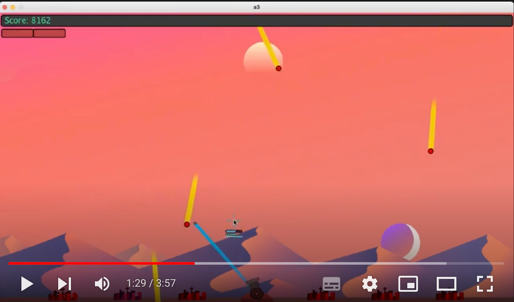

# Missile Command

## Description

A JavaScript/HTML5 Canvas port of a Processing(Java) project I originally made with [Simon Colman](https://github.com/SiJBC "Simon's GitHub") and [Nathan Hall](https://github.com/Zero4793 "Nathan's GitHub") for a university group project. Based on Missile Command an arcade classic originally developed in 1980 by Atari.

The first 209 commits of this project show the processing project, after which I deleted everything to start with JavaScript and HTM5 Canvas using the old processing project as a reference.

### The goals of this project are:

- Have the game run on the web using JavaScript and HTML5 Canvas
- Practice using JavScript, HTML5 Canvas, ES6 classes and OOP
- Make use of OOP and ES6 classes - the original project was a mix of classes and files of functions
- Avoid using global variables that are accessible outside of the files they are created in
- If you must use a global variable outside of the file it was created in make sure to explicitly export and import it - in the old project processing allowed the use of global variables without exporting and importing them - making it hard to see where a variable had come from
- Use function, method and class parameters or class fields in preference to exporting and importing globals
- Code should be simple, readable and modular - variable, function, class and method names should be used to make explicit what the code does, magic numbers should be avoided and named variables used instead. Comments should be used when needed to explain anything that might be unclear, or to provide references to sources.

### See a Video of the Processing Project Gameplay here:

[Missile Command Processing Project Gameplay](https://youtu.be/IdZDe-VThaM 'Original Processing Project on Youtube.')

### See a Video of the Original Atari 1980 Gameplay here:

[Missile Command Gameplay](https://www.youtube.com/embed/uJijGLGHRTE 'Original 1980 Missile Command on Youtube.')
