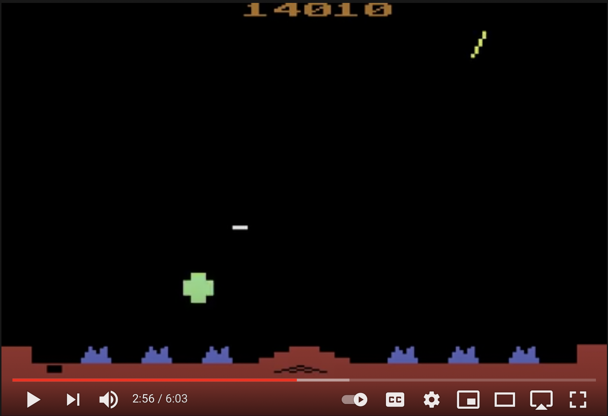

# MissileCommand  
### Authors: Simon Colman, Nathan Hall and Kristy Martin

## Description
COSC101 Group Project - Assignment 3 is based on Missile Command an arcade classic originally developed in 1980 by Atari. It conatins the following elements:

[Missile Command Game Play](https://www.youtube.com/embed/uJijGLGHRTE "Original 1980 Missile Command.")

* The player must defend six cities that sit at the bottom of the screen from randomly falling balistic misslies, using an anti-missile battery. 

* The anit-missile battery fires counter-missiles to intercept and destroy the ballistic missiles raining down. 

* The player controls a cross-hair that specifies where the counter-missile will detonate. 

* When the counter-missile reaches the location, it explodes leaving an expanding fireball that lasts for several seconds.

* All ballistic missiles that come in contact with the fireball are destroyed. 

* There are a finite number of anti-missiles and once depleted, the cities are left defenceless. 

* The game is broken into rounds that contain a specified number of ballistic missiles.

## Tasks
To meet the assignment requirments the game needs the following:

1) The cities that are under attack.
2) The ballistic missiles that rain down on the cities.
3) The anti-ballistic missile battery that fires counter-missiles.
4) A scoring system that rewards the player for shooting the ballistic missiles and any left-over munitions at the end of a given round.
5) The game should reset (and potentially move to a harder level) when the player destroys all of the ballistic missiles in a given round.

## Possible Advanced Features
Some advanced features that might result in bonus marks include (but are not limited to):

* The implementation of vector-based motion (Do some research on using the PVector object).
* Implementing additional types of attackers (e.g. The Smart * Bombs that can be seen in the Atari 2600 Gameplay).
* Multiple missile batteries with different counter missiles (e.g. some might move faster
* Advanced Visual elements such as explosion effects when a missile is destroyed.
* Sound effects (do some research on implementing these).
* Advanced levelling system - new features introduced each level.

## Review Video
Your group will also need to record a short video that demonstrates your solution in action and walks through how you have implemented the various sections. You should describe the design decisions that led to your implementation. 

This video will be viewed by other students enrolled in the unit so that we can compare the different approaches adopted and the design decisions. 

You should also outline which parts of the project were contributed by each team member and how you overcame any challenges faced through the project. 

The desired format for the video is a screen capture that you talk across, which will allow you to highlight and demonstrate sections of your code. 

To complete this task, you either use the Kaltura Capture Application (Available in the MyMedia Repository) or the Open Broadcaster software. This tool is open-source and available on Windows, macOS, and Linux. You are free to include a webcam inset into the video if you wish, but this is not required.

To submit this video, you will need to upload it to the 'My Media' repository in Moodle (available on the left menu bar in moodle) and embed the video into the text editor that appears in the assignment submission screen. Please review the 'Embed/submit' tutorial on the MyMedia page.

The peer-review exercise will be part of assignment 4.

**Copy the Embed URL of your video, and paste it into the heading comments of your Processing code.**

## Submission
Your submission will consist of two parts:

The first part will consist of your implementation in Processing. This should be submitted as a .zip archive that contains your Processing project via the moodle submission system.

The second item in your initial submission is the video and link for your overview. This should be embedded into the text editor that appears in the assignment submission screen and linked from the heading block in your assignment code.

## Marking

**Implementation - 75%**

**Components in this section include:**

**Solution Correctness:**
* Are all of the basic components implemented?
* Is there any "buggy" behaviour?

**Quality of Solution:**
* Is your code broken down into functions?
* Is your code reasonably efficient (e.g. each function not more than about 60 lines - excluding braces, comments and whitespace)?
* Have you generated general-purpose/reusable functions?
* Does the code run without errors/warnings?
* Have you avoided the use of hard-coded values?

**Coding style:**

* Is your indentation consistent?
* Have blank lines been used so that the code is easy to read?
* Are any lines longer than 80 characters (i.e. off the end of the screen)? 
* Are capitalisation and naming conventions consistent?

**Internal Documentation:**

* Does your header block contain the author's name, the purpose of the program and a description of how to compile and run the solution?
* Are variables and functions named in a meaningful way?
* Are any obscure sections fully explained?
* Do your function have a header block that explains the purpose, its arguments and return value?

**Bonus features - 10%**

This section is worth 5 more marks than the previous assignments so you will need to do a little bit more!

**Components in this section could include:** 

* Additional/advanced visual features.
* Sound effects.
* Uses PVectors
* Advanced levelling systems.

**Video Review - 15%**

Components in this section include:

* Is the video quality is suitable for viewing your solution?
* Is the Speech is clear and understandable?
* Have you covered the key design decisions in your implementation?
* Has each member contributed to the project?
